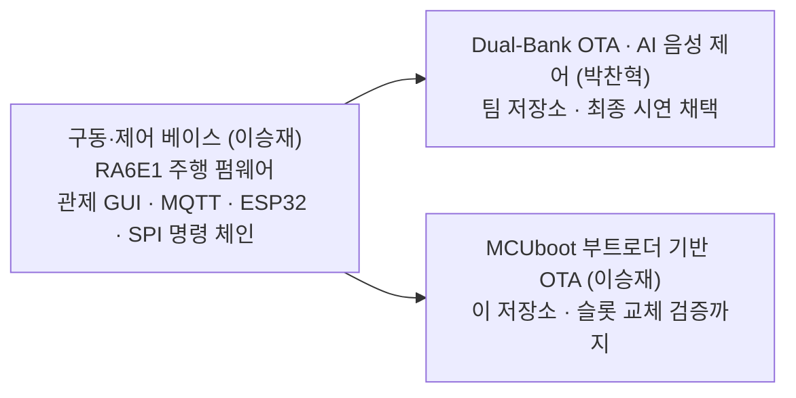

# RA6E1 RC카 - MCUboot 부트로더 기반 OTA

Renesas RA6E1(FPB-RA6E1) RC카에 **MCUboot 부트로더 기반 보안 OTA**를 구현한 개인 심화 저장소. SSAFY 임베디드 트랙 15기 1학기 관통 PJT 에서 팀의 무선 OTA 기능을 MCUboot 방식으로 독립 시도한 기록.

> **이 방식은 미완성.** 부트로더 서명 검증과 슬롯 교체(C-7a)까지 검증했으나, 앱이 실행 중 스스로 펌웨어를 기록하는 무선 전송(C-7b)에서 코드플래시 self-programming 제약에 막힘. 팀 최종 시연은 완성된 팀원의 Dual-Bank 방식으로 진행. 상세는 [개발 정리 문서](docs/02_MCUboot_OTA_개발정리.md) 참조.

---

## 무엇을 했나

- **MCUboot 부트로더 포팅**: Reset 직후 부트로더가 먼저 실행되어 이미지 서명을 검증한 뒤 애플리케이션으로 점프하는 표준 보안 부트 구조를 RA6E1에 포팅
- **ECDSA P-256 서명 검증**: MbedTLS 기반으로 승인된 펌웨어만 부팅
- **슬롯 교체 검증 (C-7a)**: Primary/Secondary 슬롯 구조에서 새 이미지를 스테이징하고 부트로더가 감지·복사·부팅하는 전 과정 실기 검증 (모터 동작 v1.0 직진 → v1.5 지그재그 전환 확인)
- **무선 제어 게이트웨이**: PC GUI → MQTT → ESP32 → SPI → RA6E1 주행 명령 체인 구현

## 어디서 막혔나

앱이 실행 중인 코드플래시(0x10000)에서 같은 코드플래시(0x88000)에 직접 쓰면 쓰기 동작 중 다음 명령을 fetch 하지 못해 hang. 해소하려면 Flash 쓰기 코드를 RAM 에서 실행해야 하나(링커 스크립트 + `.ramfunc`), 시연 일정 내 완성이 어려워 중단.

> 팀원의 Dual-Bank 방식은 같은 self-programming 제약을 하드웨어 뱅크 전환으로 우회하는 다른 해법.

---

## 개발 계보

구동·제어 베이스를 먼저 구축하고, 그 위에서 OTA 구현이 두 갈래로 분기.



---

## 저장소 구성

```
rccar-mcuboot-ota/
├── ra_mcuboot_rccar/     # MCUboot 부트로더 (Flash 0x0~0x10000)
│                         #   서명 검증 후 앱으로 점프. mbedtls · MCUboot · ECDSA 포함
├── 1st_pjt_rccar_ota/    # RC카 애플리케이션 (Flash 0x10000~)
│                         #   부트로더가 부팅시키는 대상. SPI 명령 수신 후 모터 제어
├── gateway/              # 무선 제어 체인
│   ├── mainwindow.py     #   PySide6 관제 GUI
│   └── esp32_gateway.ino #   MQTT → SPI 변환 게이트웨이
└── docs/
    └── 02_MCUboot_OTA_개발정리.md   # 상세 개발 기록
```

- `1st_pjt_rccar_ota` 는 팀 저장소와 동일한 구동·제어 베이스 사본. 부트로더 검증에 부팅 대상이 필요해 함께 둠
- `gateway` 는 그 베이스의 무선 제어 체인 원형이며, 팀 저장소 `rccar_pjt/OTA/` 의 `esp32.ino` · `mainwindow.py` 가 여기에 OTA 전송이 얹힌 확장본

## Flash 메모리 레이아웃

| 영역 | 주소 | 크기 | 역할 |
|------|------|------|------|
| Bootloader | 0x00000 ~ 0x10000 | 64KB | MCUboot 부트로더 |
| Primary Slot | 0x10000 ~ 0x88000 | 480KB | 실행 중인 펌웨어 |
| Secondary Slot | 0x88000 ~ 0x100000 | 480KB | 새 펌웨어 스테이징 |

- 이미지 헤더 = 슬롯 시작 (매직 `96F3B83D`), 코드 본체 = 슬롯 시작 + 0x200
- Overwrite 모드: 부트로더가 Secondary의 유효 이미지를 Primary로 복사 후 부팅

---

## 무선 제어 게이트웨이 (gateway/)

MCUboot RC카 무선 조종용 PC GUI 와 ESP32 게이트웨이.


### MQTT 규격
- 브로커: `192.168.0.22:1883` (실제 IP로 수정)
- 발행 `RCCar/command`: `{"time":..,"cmd_string":"go","arg_string":100,"is_finish":1}`
- 구독 `RCCar/sensing`: `{"time":..,"num1":12.34,"num2":56.78,"is_finish":0}`

### 명령 매핑 (GUI → SPI → Renesas)

| GUI cmd_string | SPI 바이트 | Renesas 동작 |
|:---:|:---:|:---|
| go | `w` | 전진 |
| back | `x` | 후진 |
| left | `a` | 좌회전 |
| right | `d` | 우회전 |
| mid | `s` | 조향 중립 |
| stop | `f` | 정지 |

### 실행
```bash
# GUI (PC) - ui_form.py 필요
pip install PySide6 paho-mqtt pytz
python gateway/mainwindow.py

# ESP32 (Arduino IDE) - PubSubClient, ArduinoJson 필요
#   esp32_gateway.ino 상단 WiFi/브로커 IP 수정 후 업로드

# 브로커 (Rpi5/PC)
sudo apt install mosquitto mosquitto-clients   # 포트 1883
```

> `ui_form.py`(Qt Designer 생성)가 `mainwindow.py` 와 함께 필요. 버튼 objectName 은 startButton/stopButton/goButton/backButton/leftButton/rightButton/midButton 기준.

---

## 하드웨어

- **MCU**: FPB-RA6E1 (R7FA6E10F2CFP), Cortex-M33, Code Flash 1MB / SRAM 256KB
- **구동**: 자동차식. 뒷바퀴 DC 모터 + 앞바퀴 서보 조향
- **모터 제어**: PCA9685 Motor HAT, I2C 0x6f (P400=SCL, P401=SDA)
  - 조향(서보 ch0): Left=300, Mid=380, Right=440
  - 구동(DC): IN1=12, IN2=11, PWM=13

### SPI 배선 (ESP32 Master ↔ Renesas Slave)

| ESP32 | Renesas | 역할 |
|-------|---------|------|
| GPIO5 | P402 | CS |
| GPIO18 | P102 | SCK |
| GPIO23 | P101 | MOSI |
| GPIO19 | P100 | MISO |
| GND | GND | 공통 GND 필수 |

## 빌드 환경

- e2 studio + FSP
- GNU ARM 13.2.1, Flat (Non-TrustZone) 구성
- 부트로더는 `mcuboot_quick_setup()` → `RM_MCUBOOT_PORT_BootApp()` 순으로 앱 부팅

> **보안 주의**: 서명 키 `root-ec-p256.pem` 은 `.gitignore` 로 제외되어 저장소에 미포함. 빌드 시 별도 생성·배치 필요.

---

## 관련 저장소

- **팀 전체 프로젝트**: [rccar_ota_project](https://github.com/SJLee-83/rccar_ota_project) - Dual-Bank OTA(최종 채택), AI 음성 제어, 충돌 회피 등 전체 시스템. 구동·제어 베이스(`1st_pjt_rccar_ota`)는 두 저장소가 공유

## 개발자

이승재 - RA6E1 펌웨어 · 주행/센서 제어 · 무선 제어 체인(GUI · MQTT · ESP32 게이트웨이) 담당
